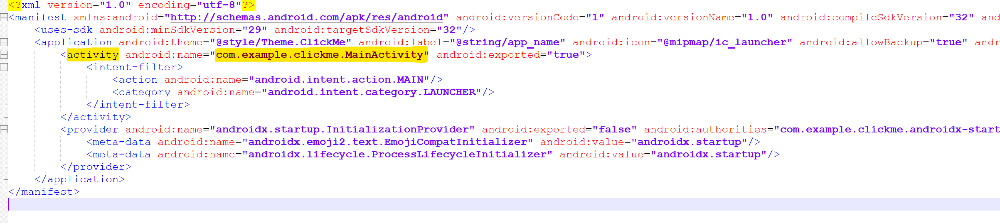
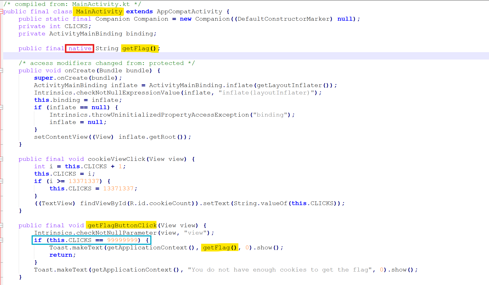
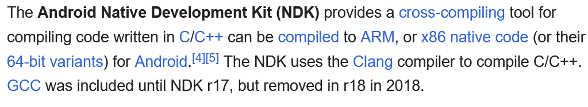
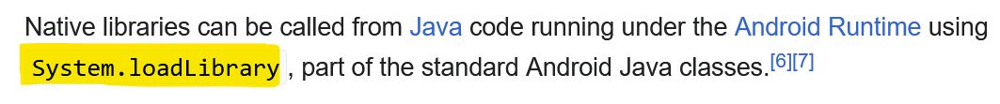
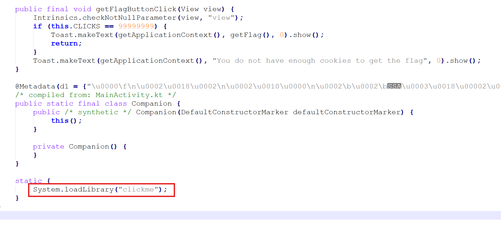
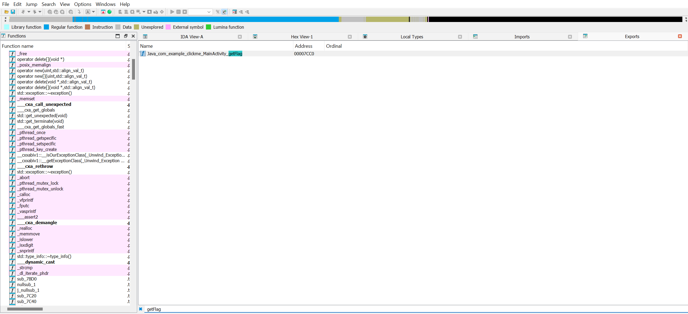
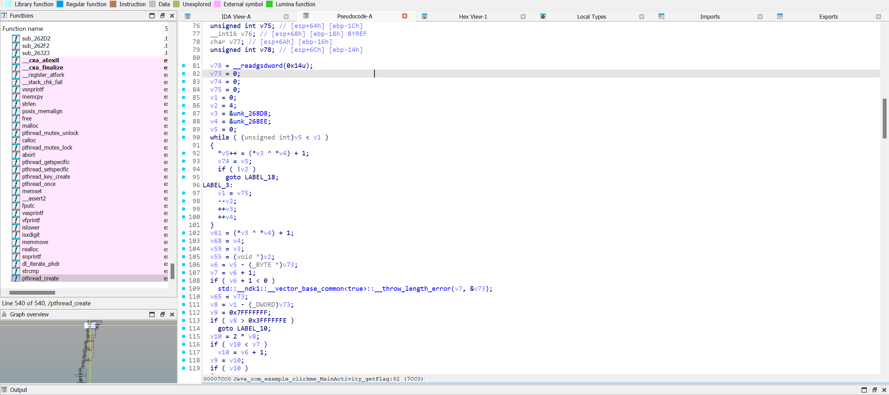
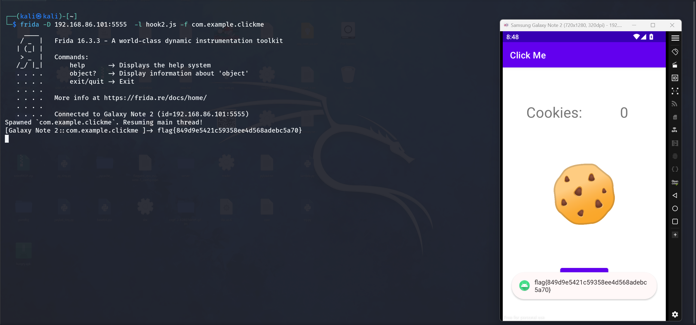

Firstly, we can extract the source code from an APK file using apktool.

```Shell
apktool d file.apk
```


open the ```/clickme/resources/AndroidManifest.xml``` to find the entry point of app 




Let's inspect the source code of ```/clickme/sources/com/example/clickme/MainActivity.java```




We found a native function called getFlag. The question is, what is a native function?






Now we know that the  ```getFlag``` function come from Library called ```clickme``` 



We can find the library at ```/clickme/resources/lib/x86/``` named  ```libclickme.so```,so we know is C/C++ we can open with IDA or Ghidra to look inside it.
Just go to the exports and search for ```getFlag```




Press Alt+3 to display as pseudocode.



There's a lot of code here, so it will take some time. I just want to show you where we can find the getFlag function.

Let's go to hooking the function to get the value that ```getFlag``` provides to us.

I will be using Frida to hook functions and Genymotion as an Android emulator.

We will create a JavaScript API using [this documentation](https://frida.re/docs/javascript-api/#java) from Frida to hook into the functions. 

```js
Java.perform(function(){
    var app_clickme = Java.use("com.example.clickme.MainActivity");
    app_clickme.getFlagButtonClick.implementation = function(view){
        this.CLICKS.value = 99999999;  
        var returnValue  = this.getFlagButtonClick(view); // calls the original function.
        console.log(this.getFlag());  // print the value of getFlag() in cmd.
        return returnValue;
    }

});

```

after clicking the button, we obtain the flag.




# EXTRA

If we have a lot of buttons on the screen (e.g., 10,000 buttons and 10,000 functions) and we know that only one button is executing a function from 10,000 functions,
how can we determine which button is executing the a function when it is clicked ?
  


>[!NOTE]
>This is a challenge from NahamCon CTF 2022.
